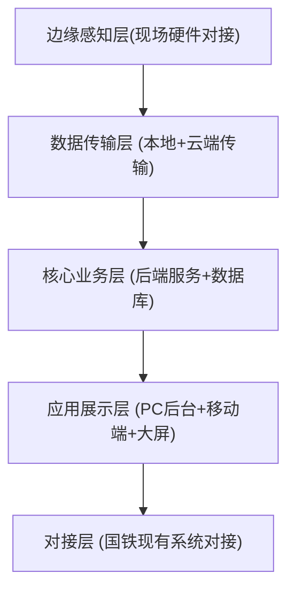

# 铁路货车智能检修系统MVP开发框架

## MVP核心目标

MVP阶段只验证一个核心价值：**用数字化替代传统纸质检修，解决轮轴等核心部件信息流转低效、数据不准确的行业痛点**，快速打通核心流程，验证业务价值后再扩展其他功能。

---

## MVP核心模块（按优先级排序）

MVP只做最核心的4个模块，不追求功能大而全：

### 1. **核心部件数字身份管理模块（MVP第一优先级）**

这是整个系统的基础，先解决"每个部件去哪里了，修过多少次"这个核心痛点：


| 核心功能           | 具体说明                                                                                              |
| ------------------ | ----------------------------------------------------------------------------------------------------- |
| 唯一ID生成         | 给每根轮轴（后续扩展其他核心部件）生成全局唯一ID，打**条形码/二维码标签**，实现一根轮轴一个数字身份证 |
| 基础信息录入       | 支持录入轮轴型号、生产日期、装机信息、初始参数等基础信息，支持PC端录入+手持移动端补录                 |
| 全生命周期履历管理 | 记录轮轴从生产到报废的每一次检修、复检、参数变更记录，随时可查                                        |
| 报废状态管理       | 标记达到报废标准的轮轴，自动同步到库存管理，避免流入生产环节                                          |

**为什么第一做这个？** 这是行业最痛的点，原来纸质卡片丢了就找不到轮轴履历，直接解决这个问题就能快速得到客户认可。

---

### 2. **工位数据自动采集与同步模块（MVP第二优先级）**

打通现有硬件设备，实现数据自动采集，不需要人工二次录入：


| 核心功能       | 具体说明                                                                               |
| -------------- | -------------------------------------------------------------------------------------- |
| 硬件设备对接   | 对接轮对尺寸自动检测机、超声波探伤仪等现有工位设备，通过接口自动读取检测数据           |
| 手动补录兜底   | 对于还没自动化的工位，支持手持机/工位PC手动录入数据，覆盖所有场景                      |
| 实时云端同步   | 数据采集完成后自动同步到云端数据库，实现「检测即上传、数据即共享」，不需要后续人工补录 |
| 数据完整性校验 | 自动校验必填数据是否完整，不完整弹窗提醒，避免漏检漏录                                 |

---

### 3. **基础生产调度与流程管控模块（MVP第三优先级）**

实现检修流程的分钟级管控，提升检修效率：


| 核心功能         | 具体说明                                                                                                            |
| ---------------- | ------------------------------------------------------------------------------------------------------------------- |
| 检修任务派发     | 根据扣修计划，自动给各个工位派发检修任务，支持手动调整                                                              |
| 生产节拍跟踪     | 记录每个工位检修开始/结束时间，超时自动预警，拆解200+生产节拍，实时监控进度                                         |
| 一车一档管理     | 每辆货车从扣修到交付，所有检修数据自动归集到一个电子档案，完工后自动归档                                            |
| 对接现有国铁系统 | 提供标准接口，对接国铁现有**HMIS（铁路货车技术管理信息系统）**和**HCCBM（货车状态监测维修系统）**，满足数据上报要求 |

---

### 4. **基础故障预警与查询统计模块（MVP第四优先级）**

提供基础数据价值输出，不做复杂的AI预测，验证基础价值：


| 核心功能       | 具体说明                                                           |
| -------------- | ------------------------------------------------------------------ |
| 基础异常预警   | 对超期未修、参数超标、即将到报废期的轮轴，自动触发预警             |
| 多维度查询统计 | 支持按车号、轮轴ID、检修日期、故障类型查询，自动生成基础统计报表   |
| 车间可视化大屏 | 展示当日检修任务完成进度、在修车辆数量、预警部件统计，满足管理需求 |

---

## 🏗️ MVP开发框架设计

铁路货车智能检修是典型的**IoT+Web系统**，MVP框架遵循「最小成本、完整可运行」原则，分层架构如下：

### 架构分层图



### 各层MVP实现说明

#### 1. 边缘感知层（MVP简化实现）

- **硬件对接**：优先对接现有在用设备，不追求新增昂贵硬件，只做接口适配
- 传感器：MVP只保留核心尺寸检测设备的数据对接，不新增额外传感器
- 边缘计算：不需要复杂的本地推理，数据采集后直接同步云端，简化开发

#### 2. 数据传输层

- 支持有线+无线两种方式，优先保证稳定，断网场景做本地缓存，联网后自动重传
- 不需要做复杂的边缘云协同，MVP阶段全部数据存云端，降低开发复杂度

#### 3. 核心业务层

- **技术栈选择**：
  - 后端：Java SpringBoot（国铁系统主流技术栈，对接方便）/Python FastAPI（快速开发）二选一
  - 数据库：关系型用MySQL，时序数据可以先用MySQL存，MVP不用单独上InfluxDB
  - 对象存储：存检测图像、文档用MinIO（私有部署）或者阿里云OSS，满足需求就行
- **核心表设计示例（轮轴表）**：
  ```sql
  CREATE TABLE `axle_info` (
    `axle_id` varchar(32) PRIMARY KEY COMMENT '轮轴唯一ID',
    `axle_no` varchar(32) COMMENT '轮轴编号',
    `factory` varchar(64) COMMENT '生产厂家',
    `produce_date` date COMMENT '生产日期',
    `install_date` date COMMENT '装机日期',
    `current_status` tinyint COMMENT '当前状态：0-在役 1-检修 2-报废',
    `scrap_date` date COMMENT '报废日期',
    `create_time` datetime DEFAULT CURRENT_TIMESTAMP,
    `update_time` datetime DEFAULT CURRENT_TIMESTAMP ON UPDATE CURRENT_TIMESTAMP
  ) ENGINE=InnoDB DEFAULT CHARSET=utf8mb4 COMMENT '轮轴基础信息表';
  ```

#### 4. 应用展示层

MVP只做三个核心端，满足不同角色需求：

- **PC端管理后台**：给管理员和调度员用，做任务派发、信息查询、报表导出
- **移动端手持APP**：给一线检修人员用，做数据采集、扫码查询、异常上报（如果开发时间紧，可以先用微信小程序替代，快速验证）
- **车间可视化大屏**：给车间管理者看，只展示核心生产数据和预警，用ECharts快速开发，不用做复杂交互

#### 5. 外部对接层

MVP只对接国铁两个核心现有系统，满足合规要求：

- **HMIS**：提供标准数据导出接口，支持自动上传数据，满足国铁数据上报要求
- **HCCBM**：对接现有状态监测数据，获取车辆运行状态，为后续预警扩展留接口

### 📋 MVP开发 roadmap（参考）


| 阶段                        | 时间  | 交付内容                                   |
| --------------------------- | ----- | ------------------------------------------ |
| 需求调研                    | 1小时 | 明确对接的现有硬件接口、国铁系统对接要求   |
| 核心数据库设计+基础框架搭建 | 1小时 | 完成核心表结构，后端基础服务、前端基础架子 |
| 核心模块开发（1+2）         | 2小时 | 完成数字身份管理、数据采集同步模块开发联调 |
| 生产调度+统计查询模块开发   | 2小时 | 完成流程管控、报表查询、大屏开发           |
| 系统对接+现场测试           | 1小时 | 对接国铁现有系统，现场部署测试，收集反馈   |
| MVP上线                     | 7小时 | 完成MVP上线验证                            |

### ⚠️ MVP开发避坑提示

- **不要一开始就上AI大模型、全故障预测**：MVP先把基础数据打通，验证数字化替代纸质的核心价值，AI功能后续迭代
- **不要追求全覆盖所有部件**：MVP先只做轮轴这一个核心部件，验证成功后再扩展制动、车体等其他部件
- **不要轻易替换现有硬件**：优先适配客户现有在用设备，降低客户接入成本，后续再逐步升级智能硬件
- **必须对接国铁现有系统**：国铁现有系统是刚需，MVP阶段就要做好接口，不能留到上线后再做

## 部署上线

<!-- 请参考：https://docs.github.com/en/pages，把/prototype目录部署上去
1. 确保这个项目可以关联 Github 远程仓库， 如果没有，你要引导我创建并 上传我的项目
2. 你需要执行部署，并告诉我最终的访问地址 -->
